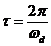

### Procedure
**(a) Experimental set up and procedure**

You see a Spring-Mass-Damper system supported at bottom (spring and damper are grounded and they support a mass). The values of K, M and C can be entered by using the buttons provided on the screen by typing numerical values. Similarly, value of initial displacement X to be given to the can be entered. Click the 'run' button with icon and leave. This is like releasing the mass that was pressed through X m. On leaving, the mass will vibrate up and down. These are damped natural vibration because the mass is vibrating in response to the initial disturbance alone without any external force acting continuously and damping is present. The displacement of the mass with respect to its equilibrium position (i.e. the position before the initial displacement was given) will be as shown in the plot. Make the following observation from the plot and use the data obtained from the plot to obtain values of damping factor and damped natural frequency of the system.

**(b) Observation and analysis:**

1. Observe the plot x v/s t, particularly the amplitude of x. Note that the amplitude is exponentially decaying with respect to time, t. Time taken to complete one cycle, i.e. the time period &iota;, is constant.
 
2. Measure the time period, &iota;, (the difference between time of similar points of two consecutive cycles) thrice and take average
 
3. Measure amplitudes of any two successive cycles and take natural logarithm of ratio the amplitudes, greater amplitude to the smaller one. This is called logarithmic decrement, &delta;. Repeat this thrice and take average.

4. 

5. Use following formulae to find damping factor, &zeta;, and damped natural frequency of the system, &omega;d, from the values of &iota; and &delta;obtained from the steps above.  and 

6. Substitute the values of &delta; and &iota; above and find out damped natural frequency, &omega;d, and damping factor, &zeta;, for the system.
 

7. Change value of coefficient of damping C on the screen. This will change the value of damping factor, &zeta;. But take care that it remains less than 1 so that the system is under-damped and the foregoing discussion is valid.
 

8. Repeat the procedure from steps 1 through 6.
 

9. Note the changes in time period &iota;, and logarithmic decrement, &delta;,
You will find that the time period decreases with increasing &zeta;, i.e. damped natural frequency decreases with increasing &zeta;. And the rate of decay of amplitude increases with increase in value of the damping factor, &zeta;.

**(c) Do This**

Use the values of damped natural frequency, &omega;d, and damping factor, &zeta;, and find undamped natural frequency, &omega;n and damping coefficient, C,

